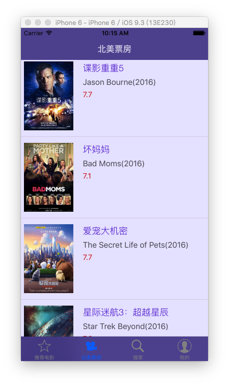
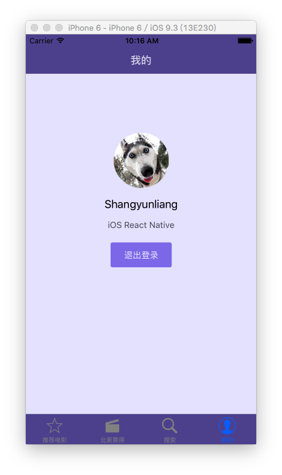

# DoubanMovie
An example based on React Native
本项目只是个人学习时候做的。大神可以不看。另找资料。

## Set up
1. **Clone the repo:**

		$ git clone https://github.com/Shangyunliang/DoubanMovie.git  
		$ cd DoubanMovie
	
1. **Install dependencies:**

		$ npm install

1. **Install react-native-cli:**

		$ npm install -g react-native-cli

1. **Running on iOS:**

		$ react-native run-ios

## Troubleshooting
> Could not connect to development server

In a separate terminal window run:

		$ react-native start
